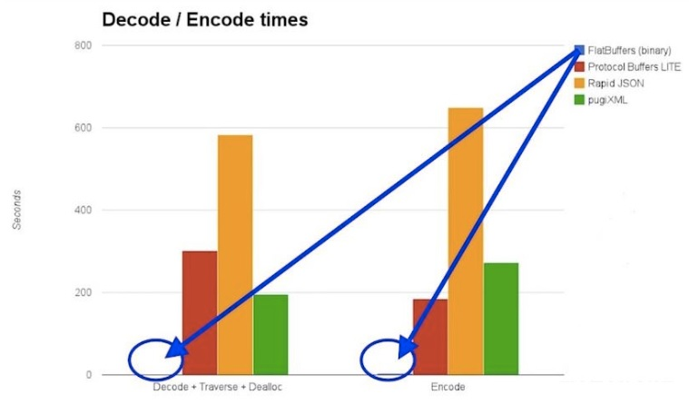

# Flatbuffers

FlatBuffers is a cross platform serialization library architected for maximum memory efficiency. It allows you to directly access serialized data without parsing/unpacking it first, while still having great forwards/backwards compatibility.

FlatBuffers is plus efficiente than [Protocol Buffers](https://protobuf.dev/)  

### Reference Documentation

For further reference, please consider the following sections:

* [FlatBuffers](https://flatbuffers.dev/)
* [FlatBuffers at github](https://github.com/google/flatbuffers)

### Build documentation

To create the classes install [flatc compiler](https://gist.github.com/ankur-anand/389536ccd5accd50143bdacf605dc79b) and:

* open terminal and go to project folder ./src/flatbuffers
* run *flatc --java product.fbs* each time you make any modifications in product.fbs and copy the Product.java generated to desired package (br.com.williamrocha.flatbuffer.fb).